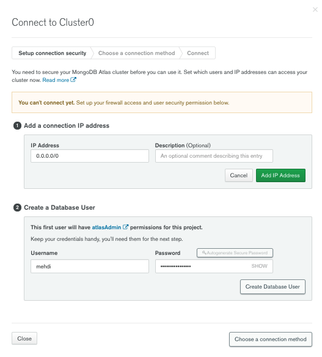

# turbo-doodle

## Assignment: PWA Budget Tracker

<a href="https://choosealicense.com/licenses/mit" target="_blank"></a>

## Description

Turbo Doodle is a full-stack budget tracker that was developed as a progressive web app (PWA).

Per MDN, a PWA app is when the app:

> "meets certain requirements, or implements a set of given features: works offline, is installable, is easy to synchronize, can send push notifications."

If you're interested in the full article, click on the following link - [What is a Progressive Web App?](https://developer.mozilla.org/en-US/docs/Web/Progressive_web_apps/Introduction)

Given the above definition, the main feature of this app is to provide the user the ability to add expenses and deposits if their internet connection is lost. See section [Offline Functionality](#offline-functionality) for more information on how this is done.

To view the final app deployed on Heroku, please click on the following [link](https://secret-sierra-86296.herokuapp.com/).

## Table of Contents:

1. [Description](#description)
1. [Technologies](#technologies)
1. [Offline Functionality](#offline-functionality)
1. [Installation](#installation)
1. [Usage](#usage)
1. [Video](#video)
1. [License](#license)
1. [Questions](#questions)

## Offline Functionality

The offline functionality is implemented through the use of IndexedDB.

Per MDN,

> "IndexedDB is a way for you to persistently store data inside a user's browser. Because it lets you create web applications with rich query abilities regardless of network availability, your applications can work both online and offline."

What's important to note is that not all browsers support this functionality. Per the below image from "Can I Use" website, it looks like Internet Explorer "IE" partially supports this functionality.

Link to: [Can I Use: IndexedDB](https://caniuse.com/?search=indexed)


### IndexedDB Basic Pattern

The below list provided by MDN summarizes the basic pattern thats encouraged inorder to successfully implement the use of IndexedDB.

1. Open a database
2. Create an object store in the database.
3. Start a transaction and make a request to do some database operation, like adding or retrieving data.
4. Wait for the operation to complete by listening to the right kind of DOM event.
5. Do something with the results (which can be found on the request object).

## Installation

- Before cloning the repository, please ensure you have node.js installed as this app requires the installing of npm packages. You will also need to ensure you have both MongoDB installed on your computer and MongoDB Atlas as the database will the remote functionality to store the data.

If you do not have node.js installed, start with steps 1 and 2. If you have node.js installed and confirmed, you can skip steps 1 and 2 and begin on step 3.

### Node.js Installation

1.  [Node.js Download Page](https://nodejs.org/en/download/)

2.  After install, check with command line to ensure setup is correct.

    a. Open your terminal

    b. Type the below command. If you see a version it means you have installed node.js correctly.

    ```bash
    node -v
    ```

### MongoDB Installation

1.  [MongoDB Community Server Installation Page](https://www.mongodb.com/try/download/community)

2.  After install, check with the command line to ensure setup is correct. If running the below commands does not output any errors, then you've correctly installed mongoDB.

    ```bash
    mongo --version
    ```

    ```bash
    mongod --version
    ```

### MongoDB Atlas Installation

1.  [MongoDB Atlas Getting Started Page](https://docs.atlas.mongodb.com/getting-started/)

2.  After creating an Atlas account, you will need to build a "Free Cluster"

3.  Once you've built a cluster, you need to do the following

    a. Click on the "Connect".

    

    b. Click on the "Add Your Current IP Address" and fill in the "Username" and "Password" fields.

    - I typically use the "Autogenerate Secure Password"

    - Please ensure you save this password somewhere as we will need to use it later when we fill in the "config.env" file.

    

## Usage

## Video

## License

<a href="https://choosealicense.com/licenses/mit" target="_blank">MIT License</a>

## Questions

Github Portfolio Link: [Mehdi Mehrabani](https://github.com/mmehr1988)<br>
